# 红黑树(Red-Black Trees)
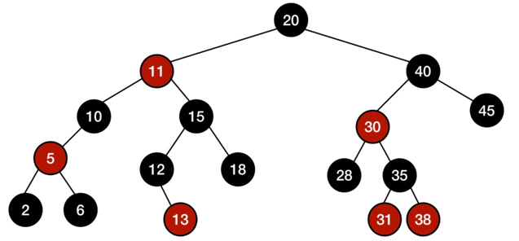

* [基础概念](#basic)
* [Balanced Search Trees平衡性](#balance)
* [红黑树的应用场景](#scenarios)
* [红黑树的特性](#feature)
* [红黑树平衡性证明](#proof)
* [2-3树](#23tree)
* [左倾红黑树](#left_leaning_tree)

<h4 id="basic">基础概念</h4>

* 关于O

  有相同增长率的不同函数可以使用同样的O函数来表示
  ```
  f(x) = O(x) 其中的=号并不是我们传统意义理解的等于号，而是属于 
  另一种表达方式属于 f(x) ∈ O(x)
  ```
  
* 关于lg
  
  ```
  ISO（国际化标准组织）标准是以10为底
  计算机科学领域是以2为底
  ```

* 简单路径
  
  ```
  如果路径上的各顶点均不相互重复，称这样的路径为简单路径
  ```
  
* 树的深度和高度
  
  ```
  深度：从某节点到根节点边的个数
  高度：从某节点到叶节点最大边的个数（从某节点到叶节点最长路径）
  ```

<h4 id="balance">Balanced Search Trees平衡性</h4>

* 严格平衡：任意节点的两颗子树的高度差的绝对值`<=1`

* 近似平衡：只要满足树的高度为`O(lgn)`，则该树是一颗平衡树

<h4 id='scenarios'>红黑树的应用场景</h4>

* `Java`中的`TreeMap, TreeSet`的实现
  
* `nginx`中的`Timer`管理

* `Linux`中虚拟内存的管理

* `C++ STL`实现了红黑树

<h4 id='feature'>红黑树的特性</h4>

1. 任意节点要么是红色，要么是黑色
   
2. 根节点是黑色
   
3. 红色节点不能连续出现，它的父节点和子节点都是黑色
   
4. 任意节点到它后代叶节点的所有简单路径包含有相同数量的黑色节点

<h4 id='proof'>红黑树平衡性证明</h4>

```
n为红黑树中节点个数
BH(x)为x到叶节点黑色节点的个数

h >= BH(x) >= h/2

n >= 2**BH(x) - 1
n >= 2**(h/2) - 1
lg(n+1) >= lg(2**(h/2))
lg(n+1) >= h/2
h <= 2lg(n+1)
h = O(lg(n))
```
[`lg(𝑛+1) ∈ 𝑂(lg𝑛)`证明](https://cs.stackexchange.com/questions/54157/can-i-simplify-logn1-before-showing-that-it-is-in-olog-n/54159)

<h4 id='23tree'>2-3树</h4>

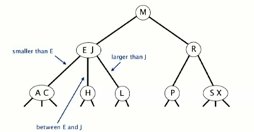

* 每个节点允许1或2个`key`
  
    * 2-节点：一个`key`，两个孩子节点
      
    * 3-节点: 一个`key`，三个孩子节点
  
* 从根节点到叶节点的路径长度相同

* 树高
  
    * 最坏情况下`O(lgn)`
      
    * 最好情况下`O(log3**n)`约等于`0.631lgn`
      
    * 树高在12到20层可以存储百万个`key`
      
    * 树高在18到30层可以存储十亿个`key`

* 插入`K`到2-节点

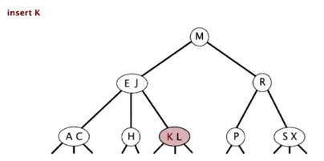
  
* 插入`Z`到3-节点

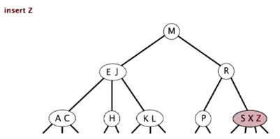
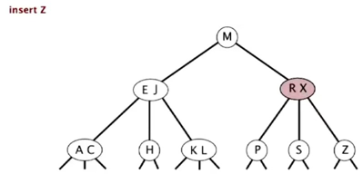

* 插入`L`到3-节点

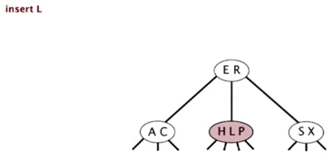

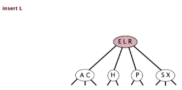

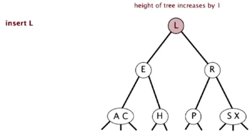

<h4 id="left_leaning_tree"> 左倾红黑树（left leaning red-black tree）</h4>

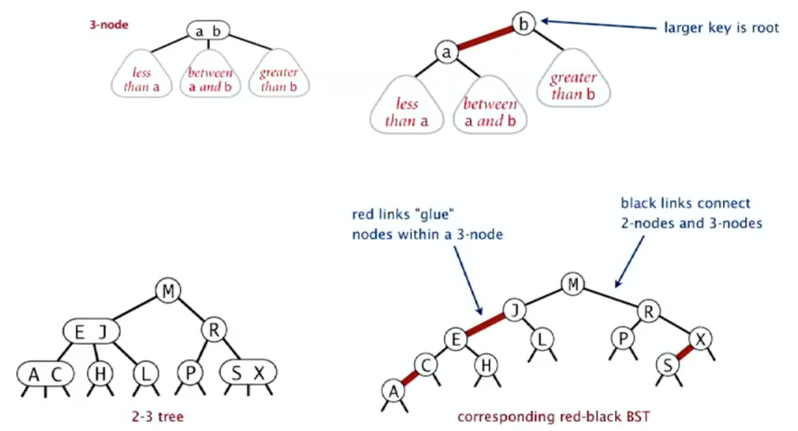

左倾红黑树的特点

  * 没有两个连续的红色路径

  * 从根节点到叶节点包含相同数量的黑色路径

  * 所有红色路径左倾

旋转和变色

* 红黑树左旋


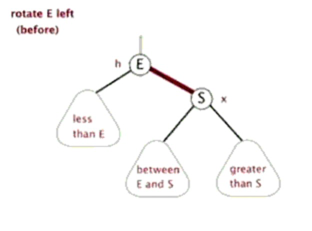

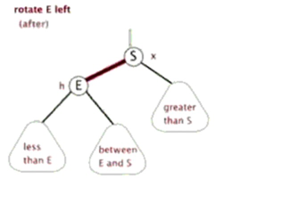

* 红黑树右旋


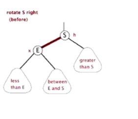

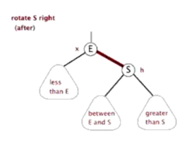

* 变色

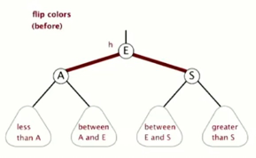
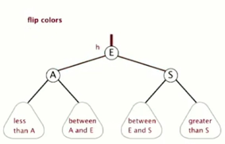

仅有一个节点，插入新节点
   
  

插入到2-节点

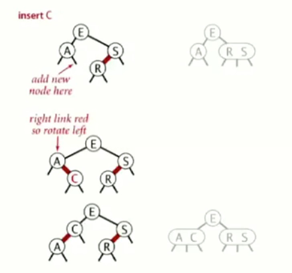

仅有两个节点，插入新节点

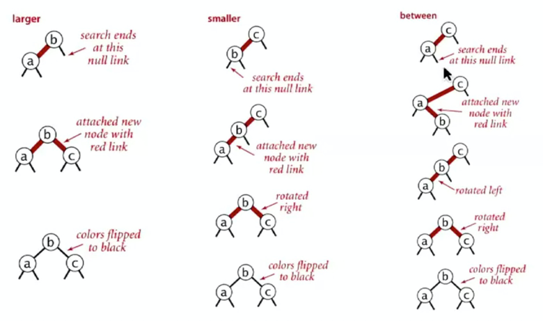

插入到3-节点

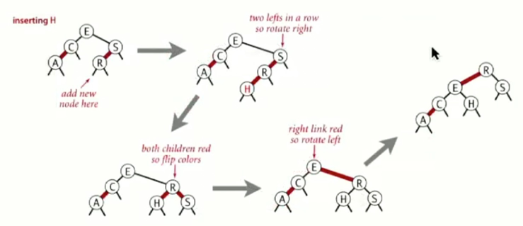

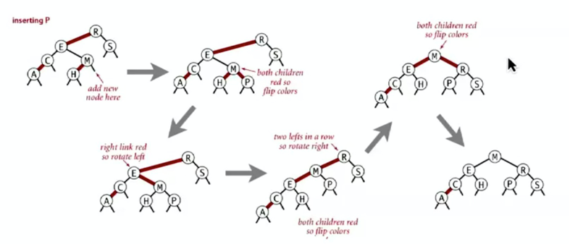

插入到3-节点


升序写入255个节点


降序写入255个节点


随机写入255个节点


